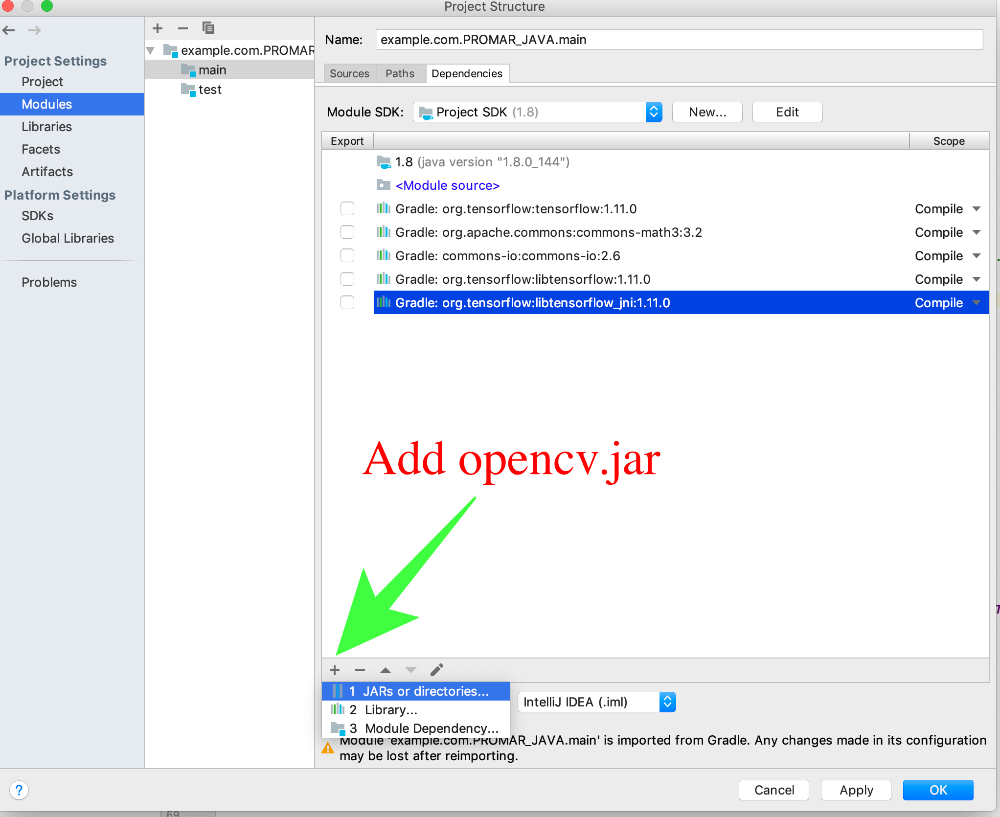
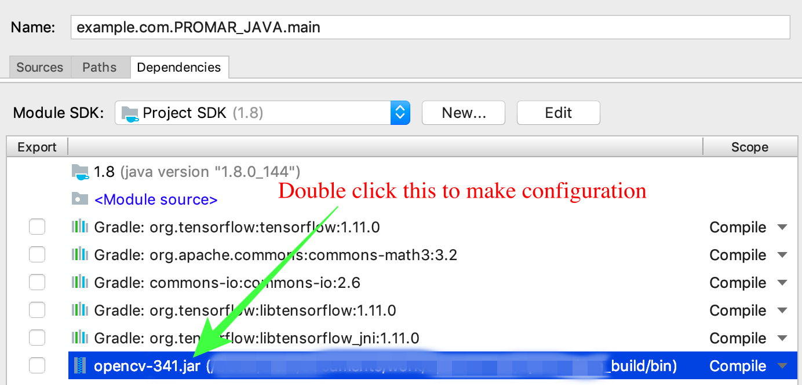
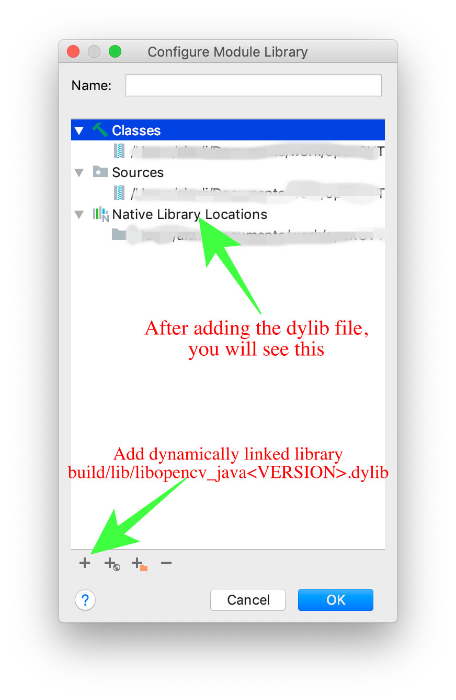

# PROMAR

This is an implementation of [PROMAR](https://github.com/PROMAR2019/PROMAR_Android/tree/master/PROMAR.pdf) on JAVA. PROMAR aims at providing multi-user AR applications on off-the-shelf smartphones without special hardware. Our demo persuasively proves PROMAR capable of offering consistent AR experience in regardless of moderate view angle changes and distance change.

The  demos videos can be found in [demo_video/](https://github.com/PROMAR2019/PROMAR_Android/tree/master/demo_video).

## Requirement

* JAVA 8 or higher
* OpenCV 3
* TensorFlow


# Instruction

## OpenCV

One requisite for PROMAR JAVA is OpenCV JAVA library. If you alread built and imported OpenCV JAVA library, you can skip this section and jump to [TensorFlow](#tensorflow).

1. Download [OpenCV 3](https://github.com/opencv/opencv) source code as well as [opencv_contrib](https://github.com/opencv/opencv_contrib) module. __(Attention: the two libraries should be on the same branch version, otherwise there may be complile error)__
2. Create directory _build_ under opencv directory for compiling.
```
mkdir build && cd build
```
3. Compile the OpenCV with opencv\_contrib module for JAVA library:
```
cmake -DOPENCV_EXTRA_MODULES_PATH=<path_to_opencv_contrib>/modules -DBUILD_SHARED_LIBS=OFF <opencv_source_directory>
```
4. Build and install
```
make -j4 && make install
```

Once successfully finish the compilation, you should be able to find JAR file opencv-<VERSION>.jar under build/bin/. One more step, and you can finish this possibly frustrating OpenCV configuration:

Add build/bin/opencv-<VERSION>.jar to the PROMAR\_JAVA main module dependencies as JAR.



Add dynamically linked library build/lib/libopencv\_java<VERSION>.dylib to opencv-<VERSION>.jar.




Congratulations! You have finished OpenCV configuration.

## TensorFlow

At present we are using [TensorFlow Object Detection API](https://github.com/tensorflow/models/tree/master/research/object_detection) to complete our object detection task. Due to the limit of file size in GitHub, you need to manually download the trained model [ssd_inception_v2_coco](http://download.tensorflow.org/models/object_detection/ssd_inception_v2_coco_2018_01_28.tar.gz), unpack the file and place the trained model file named __saved_model.pb__ under directory src/main/resources/ssd\_inception\_v2\_coco/ before you start the JAVA test.

## Enjoy

Once you finished the configurations, you are welcome to enjoy your exploration in PROMAR:)
